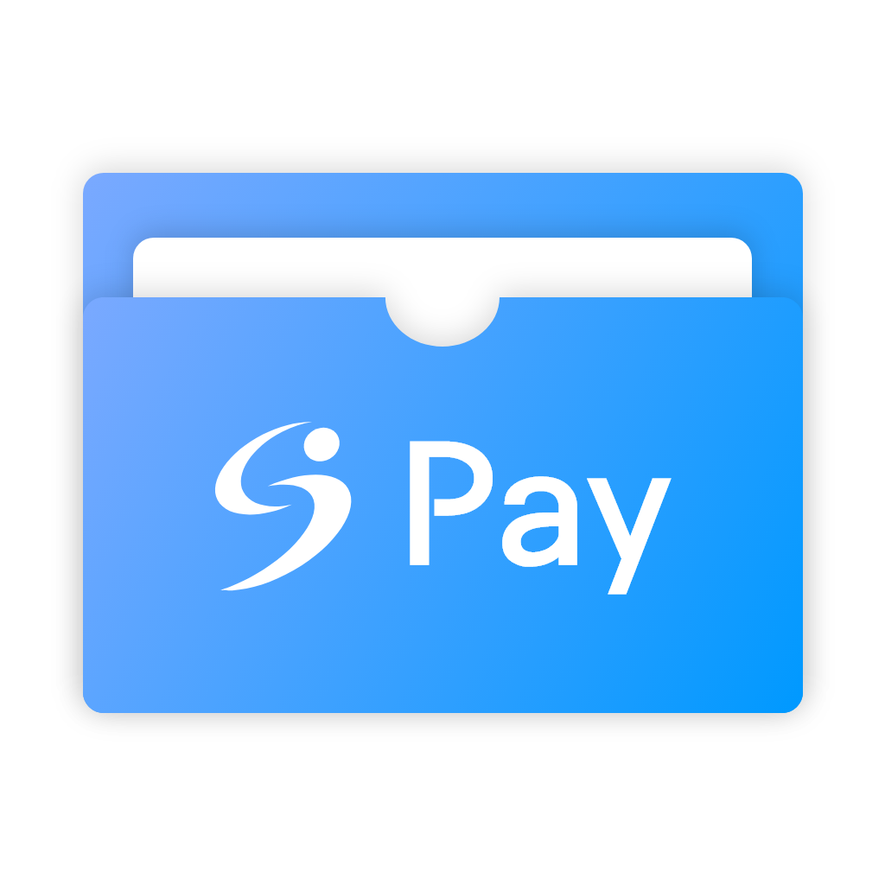

# SunrinPay 💳

1. [**소개**](#소개)
2. [**기술 스택**](#기술-스택)
3. [**기능 소개**](#기능-소개)
4. [**구경하기**](#구경하기)
5. [**설치하기**](#설치하기)
6. [**개발하기**](#개발하기)
7. [**빌드하기**](#빌드하기)
8. [**기여하기**](#기여하기)

## 소개

> 웹 기반 간편 페이먼트 & 업장 재고 관리 솔루션

- 사용자: 간편 결제 서비스와 송금
- 사업자: 편리한 재고 관리 기능 및 간소화된 PoS

- [시연 영상](https://youtu.be/-n8T0WvXXNo)

## 기술 스택

## 기능 소개

### 간편 결제

업장에서 제품의 바코드를 스캔하거나 가격을 입력하여 품목을 추가하고, 사용자에게 계산을 요청하면 QR
코드가 생성됩니다. 사용자가 QR 코드를 스캔하면 결제 화면으로 이동되며, SunrinPay에서 생성되는 지갑에
충전된 현금이나 카카오페이를 이용해 결제할 수 있습니다.

### 송금

SunrinPay 지갑에 충전된 현금을 다른 사용자에게 송금할 수 있습니다. 송금할 사용자의 QR 코드를 스캔하
거나(수령인의 메인 화면에서 'QR 코드 표시'를 탭하면 표시 가능), 수령인의 Email을 입력하여 송금할 수
있습니다. 또는, Toss를 이용해 Toss에 연결된 계좌에서 다른 계좌로의 송금도 지원합니다.

### 송금/결제 내역 확인

송금을 하거나 SunrinPay를 이용한 간편 결제를 진행하면 메인 화면에 송금/결제 내역이 표시됩니다. 업장
에서의 결제를 진행하였다면 해당 결제 건을 탭하여 상세 결제 내역(영수증)을 표시할 수 있습니다.

### 통합 재고 관리

업장에 판매 품목을 추가하거나 가격 변경, 재고 수정, 또는 할인율 설정 등의 작업이 가능합니다. 바코드
를 설정하면 추후 계산을 진행할 때 바코드를 스캔하는 것만으로도 품목 추가가 가능합니다.

## 구경하기

- [https://sunrinpay.web.app](https://sunrinpay.web.app)

## 설치하기

- `npm i`

## 개발하기

- `npm run dev`

## 빌드하기

- `npm run build`

## 기여하기

- [Issues](https://github.com/sunrinpay/sunrinpay/issues)
- [Fork](https://github.com/sunrinpay/sunrinpay/fork)
